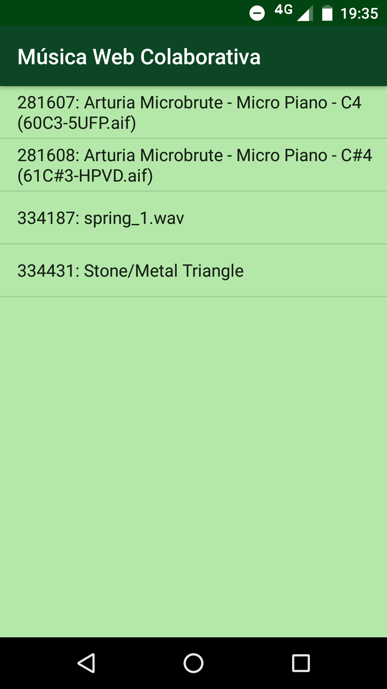

# bigdata-music-collab
BigData Music Collaboration App for Mobile Devices

    Uses MIR descriptors to search sounds around the web.

### Firebase distributed online DB

### Android client

## Android version

        minSdkVersion 16
        targetSdkVersion 25

Supports [Freesound.org API](http://www.freesound.org/docs/api/) and custom werbservice.

# Config

Firebase Google Console: https://console.firebase.google.com

    Google API Token, Freesound, etc: ./app/src/main/res/values/secrets.xml

## Permission

        Manual activate 'WRITE_EXTERNAL_STORAGE' android permission

### Acknowledgments
Icon by Oksana Latysheva (vía Noun Project)
